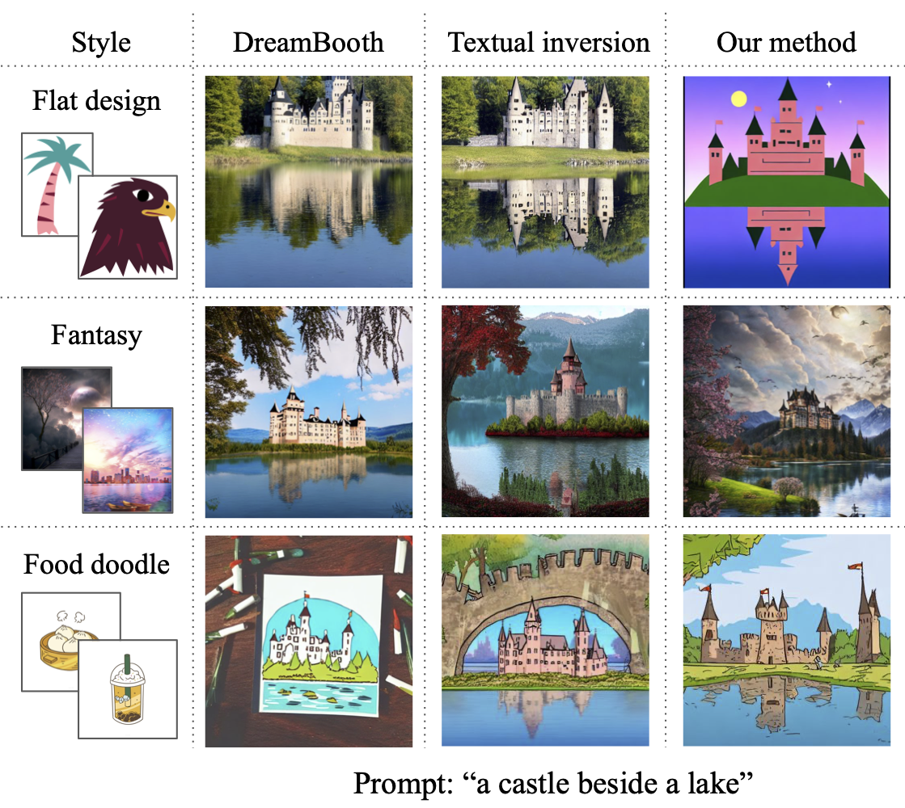
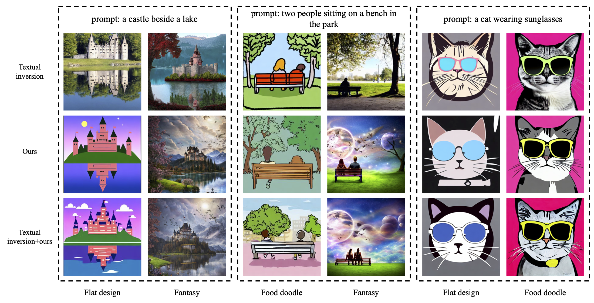

# Specialist-Diffusion
This repository is the official implementation of [Specialist Diffusion](https://openaccess.thecvf.com/content/CVPR2023/papers/Lu_Specialist_Diffusion_Plug-and-Play_Sample-Efficient_Fine-Tuning_of_Text-to-Image_Diffusion_Models_To_CVPR_2023_paper.pdf)

[**Specialist Diffusion: Plug-and-Play Sample-Efficient Fine-Tuning of Text-to-Image Diffusion Models to Learn Any Unseen Style**](https://openaccess.thecvf.com/content/CVPR2023/papers/Lu_Specialist_Diffusion_Plug-and-Play_Sample-Efficient_Fine-Tuning_of_Text-to-Image_Diffusion_Models_To_CVPR_2023_paper.pdf) \
[Haoming Lu](https://github.com/alonewithyou), [Hazarapet Tunanyan](https://hazarapet.github.io/),
[Kai Wang](https://wangk.ai/), [Shant Navasardyan](https://www.linkedin.com/in/shant-navasardyan-1302aa149/),
[Zhangyang Wang](https://www.ece.utexas.edu/people/faculty/atlas-wang), [Humphrey Shi](https://www.humphreyshi.com/)

[Paper](https://openaccess.thecvf.com/content/CVPR2023/papers/Lu_Specialist_Diffusion_Plug-and-Play_Sample-Efficient_Fine-Tuning_of_Text-to-Image_Diffusion_Models_To_CVPR_2023_paper.pdf) 
| [Project](https://specialist-diffusion.github.io/)

We present **Specialist Diffusion**, a style specific personalized text-to-image model. 
It is plug-and-play to existing diffusion models and other personalization techniques. 
It outperforms the latest few-shot personalization alternatives of diffusion models such as 
**Textual Inversion** and **DreamBooth**, in terms of learning highly sophisticated styles with ultra-sample-efficient tuning.

## Setup the environment
First, install prerequisites with:

    conda env create -f environment.yml
    conda activate sd
  
Then, set up the configuration for accelerate with:

    accelerate config

## Train a model
If you never used huggingface before, run

    huggingface-cli login
    
so the pretrained weights will be automatically downloaded.

An example call:

    accelerate launch train.py --config='configs/train_default.json'

## Evaluate a model
An example call:

    accelerate launch eval.py --config='configs/eval_default.json'

## Plug-and-Play

